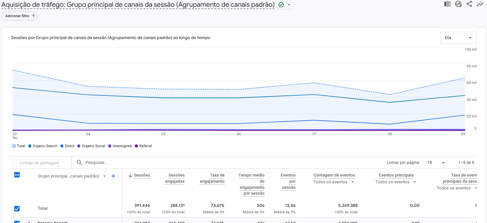
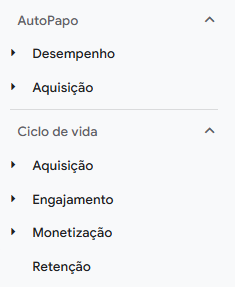

# Google Analytics 4 (GA4)

## Oque é?

Google Analytics 4 (GA4), é uma ferramenta do google de Analise de dados, com o foco em paginas WEB. Ela , possibilita que um site de propriedade sua na web seja rastreado por ele, onde ele captura diversos tipo de dados como usuários ativos, usuários totais, sessões, eventos (page_view (visualização de página)
scroll (rolagem da página)
click (cliques em botões ou links)
purchase (compra)
video_start, video_progress, video_complete (interação com vídeos)), etc. Isso possibilita que o a análise de desses dados capturados para avaliar onde melhorar no site.

## GTM

É o gerenciador de tag do google analytics que permite capturar outros tipos de eventos para análise.
Ex:

- ✅ Cliques em botões específicos (ex: botão "Comprar")
- ✅ Cliques em números de telefone ou e-mails
- ✅ Interações com formulários (envio, abandono, erro)
- ✅ Download de arquivos (PDFs, e-books, etc.)
- ✅ Tempo gasto em uma página específica
- ✅ Interação com widgets, como chatbots
- ✅ Adições ao carrinho de compras em um e-commerce
- ✅ Navegação em abas ou menus suspensos

## Universal Analytics

Universal Analytics (UA) foi a versão anterior do Google Analytics, usada para rastrear e analisar o comportamento dos usuários em sites e aplicativos. Ele foi lançado em 2012 e foi substituído pelo Google Analytics 4 (GA4) em 2023. Aplica uma abordagem diferente e pode ser usada ainda hoje em dia.

## GTAG.js

O GTAG.js (Global Site Tag) é a biblioteca oficial de rastreamento do Google usada para enviar dados para ferramentas como Google Analytics 4 (GA4), Google Ads, Google Tag Manager, Universal Analytics e outros produtos do Google. Ele muda sutilmente dependendo da aplicação que vai ser usada.

## Estrutura do GA4

GA4 account - É a conta do google analytics, ela é atrelada a conta do google.
Property - Sites proprietários de seu domínio, são os sites que estão sendo análisados pelo google analytics.
Stream - São as fontes de onde está vindo as informações dos sites proprietários, como WEB, Android e IOS.

## Termos:

- Sessões - Periodo que um usuário interagiu com um site, podendo ser varios tipos de interações (clicar no botão, assisir vídeo, etc). Junto a isso, a duração média da sessão mostra o tempo médio que os usuários ficam no site.

- Page views ou views - Mostra a quantidade de paginas vistas/carregadas dentro de um périodo consequentimente dentro das sessões no geral.

- Bounce Rate - Significa a taxa de rejeição, mostra a porcentagem de pessoas que saem do site sem interagir com ele (Não significa algo ruim dependendo do site, se for um blog não existe muita interação).

## Principais dados disponibilizados GA4

- Saber a quantidade total de pessoas visitando o site
- Saber onde está localizado os usuários que estão acessando o site
- Saber os dispositivos, suas versões, modelos etc dos usuários que estão acessando o site.
- Saber a quantidade total de sessões que aconteceram no site.
- Saber a quantidade total de page views que tiveram site.
- Saber o tempo médio das sessões que aconteceram no site.
- Saber o tempo médo de página.
- Sabe a quantidade de page views por sessão.
- Saber quais as paginas mais visitadas do site.
- Saber as consultas de pesquisas que receberam clicks.
- Saber os eventos que ocorreram no site como impressões, clicks, page_view, scroll, etc.
- Saber os países de onde os usuários estão acessando o site.
- Saber de onde está vindo a aquisição do site (de onde os usuários estão vindo).
  - **Principais meios de aquisição**
  - Organic Search - Msotra a quantidade de pessoas que estão chegando até o site por meio principal das search engines.
  - Direct - Msotra a quantidade de pessoas que estão chegando até o site por de acessos diretos ao link do site.
  - Referral - Msotra a quantidade de pessoas que estão chegando até o site por meio de outros sites com link para o meu site.

## Comparação

Funcionalidade que possibilita realizar a comparação entre os tipos de tráfego.

## Funcionalidade de filtros:

**Filtro principal**
Localizado encima do grafico de relatório da pagina.
**Filtro Secundário**
Localizado encima da tabela de relatório da pagina.

principais filtros:

- Páis
- Cidade
- SO dispositivo
- Marca Dispositivo
- Modelo Dispositivo
- Origem da sessão
- Tamanho de tela
- ETC

## Criar relatórios
O GA possibilita que crie relatórios de visão geral e detalhado com dados importados, para serem usados no painel de informações/coleções do próprio GA.

**Relatório Geral:**

    </img>

**Relatório Detalhado:**

    </img>

## Criar coleções
O GA possibilita que crie coleções novas, onde fica os relatórios de visão geral e detalhado.

**coleções:**

    </img>

