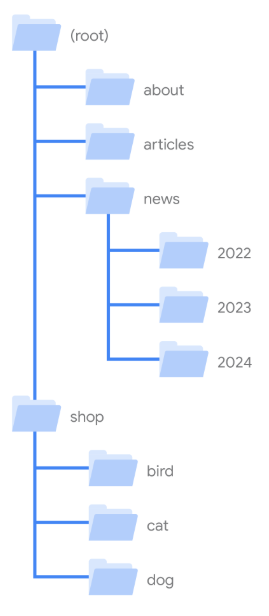

# SEO

## O que é

SEO, abreviação de otimização de mecanismos de pesquisa, tem como objetivo por meio de Fundamentos de Pesquisa, ajudar os mecanismos de pesquisa a entender seu conteúdo e ajudar os usuários a encontrar seu site e decidir se eles devem ou não acessá-lo usando um mecanismo de pesquisa.

## Termos

Search enginers - São os mecanismos de pesquisa no geral, como Google, Bing, etc.

Rastreadores - Rastreadores são programas, bots que tem por função varrer os sites disponiveis na internet em busca de páginas para adicionar ao nosso índice. Normalmente, basta ter o site publicado na web para ser adicionado ao indice da search engine.

Rastreadores Crawlers - São rastreadores que tentam imitar os rastreadores das search engines, proporcinando insight de como o site está sendo visualizado.

Inspecionar - Ferramenta de desenvolvimento disponveis nos navegadores para auxiliar em diversas questões de uma pagina web.

Spider trap - Lugares onde os rastreadores podem ficar presos

## Search engine

- GOOGLE
- BING
- YAHOO
- ETC

## Visibilidade nas search engines

### metodos:

- Agrupar páginas de tópicos semelhantes em diretórios.
- Links do seu site em outros sites que já foram rastreados.
- Reduzir o conteúdo duplicado.
- Antecipar os termos de pesquisa dos leitores Keywords.
- Titulos com curiosides (Click bait).
- Deixar o site mais prático e interessante.
- Influencie seus links de título.
- Criar links para recursos relevantes.
- Evitar anúncios que distraiam os usuários.
- Usar URLs descritivos.
- Conferir se a search engine percebe a página da mesma forma que um usuário.
- Velocidade do site (Um dos principais critérios avaliados pelas search engines).
- Imagens com qualidade e com texto alternativo descritivo.
- Vídeos com qualidade e com texto alternativo descritivo.

### Detalhamento

Procurar no google utilizando a tag site:(url do site) e ele retornando algo do site, significa que o site está no índice.
Se não aparecer verificar se não tem nenhum problema tecnico no site:
O Googlebot não está bloqueado.
A página funciona, ou seja, o Google recebe um código de status HTTP 200 (success).
A página tem conteúdo indexável.

Outra forma de uma search engine encontrar o site é por meio do link do seu site em outros sites que já foram rastreados pela ferramenta de search engine.

**sitemap** - É um arquivo enviado para as search engines que contem todas as URLs do seu site que são importantes, proporcionando o rastreamento.

**Conferir se a search engine percebe a página da mesma forma que um usuário**

Quando as search engines rastraia, o ideal é que ele perceba o conteúdo da mesma forma que um usuário comum. Então tomar cuidado para não ocultar o CSS, JavaScript... Se a ferramenta não entender a pagina, o site não aparece nos resultados de pesquisa.
As search engines oferecem suporte a várias maneiras de desativar o rastreamento e a indexação dos seus URLs, caso queira que alguma pagina não apareça nos resultados de pesquisa.

**Usar URLs descritivos**

Partes do URL podem ser exibidas nos resultados da pesquisa como navegação estrutural. Isso pode ajudar os usuários a entender se um resultado será útil para eles.
Exemplo: https://www.example.com/pets/cats.html
Evitar usar identificadores aleatórios exemplo: https://www.example.com/2/6772756D707920636174

**Agrupar páginas de tópicos semelhantes em diretórios**

milhares de URLs no seu site, a forma como você organiza o conteúdo pode afetar como o Google rastreia e indexa o site. Especificamente, usar diretórios (ou pastas) para agrupar tópicos semelhantes pode ajudar o Google a saber com que frequência há mudanças nos URLs em diretórios individuais.
Exemplo:

     

**Reduzir o conteúdo duplicado**

Ter conteúdo duplicado no site não é uma violação das nossas políticas contra spam. No entanto, isso pode afetar negativamente a experiência do usuário, e os mecanismos de pesquisa podem desperdiçar recursos de rastreamento em URLs que não são importantes. Caso queira, você pode descobrir se consegue especificar uma versão canônica para suas páginas. No entanto, se você não canonizar os URLs, o Google vai tentar fazer isso automaticamente.

**Deixar o site mais prático e interessante**

Criar conteúdo que as pessoas consideram atraente e útil provavelmente influenciará a presença do seu site nos resultados da pesquisa mais do que qualquer outra sugestão

- O texto é fácil de ler e bem organizado: escreva o conteúdo naturalmente e se certifique de que a escrita seja de qualidade, fácil de acompanhar e não tenha erros ortográficos e gramaticais. Divida o conteúdo longo em parágrafos e seções. Use também cabeçalhos para ajudar os usuários a navegar pelas páginas.
- O conteúdo é exclusivo: ao escrever conteúdo novo, não copie textos completos ou trechos criados por outras pessoas, use seus conhecimentos sobre o assunto. Não reaproveite o que outras pessoas já publicaram.
- O conteúdo é atualizado: confira o conteúdo publicado anteriormente e atualize conforme necessário, ou até mesmo o exclua, caso ele não seja mais relevante.
- O conteúdo é útil, confiável e prioriza as pessoas: escreva um conteúdo que os leitores possam achar útil e confiável. Por exemplo, incluir fontes experientes ou reconhecidas pode ajudar as pessoas a entender a especialidade das suas matérias.

**Antecipar os termos de pesquisa dos leitores Keywords**

Pense nas palavras que podem ser pesquisadas para encontrar seu conteúdo. Usuários que sabem bastante sobre um determinado tópico podem usar nas consultas palavras-chave diferentes daquelas usadas por alguém que não sabe muito sobre o assunto. Por exemplo, alguns usuários podem pesquisar por "charcutaria", enquanto outros podem pesquisar por "tábua de queijos".

**Evitar anúncios que distraiam os usuários**

Embora os anúncios façam parte da Internet e sejam criados para serem vistos, não deixe que eles distraiam demais ou impeçam que os usuários leiam o conteúdo. Por exemplo, anúncios ou páginas intersticiais (exibidas antes ou depois do conteúdo esperado) que dificultem o uso do site.

**Criar links para recursos relevantes**

Os links são uma ótima forma de conectar os usuários e mecanismos de pesquisa a outras partes do seu site ou a páginas relevantes em outros sites. Na verdade, a grande maioria das novas páginas que o Google encontra todos os dias é através de links. Por isso, eles são um recurso essencial para que suas páginas sejam descobertas pelo Google e possam aparecer nos resultados da pesquisa.

**Influencie seus links de título**

O link de título é o título do resultado da pesquisa e pode ajudar as pessoas a decidir em qual resultado clicar.

**Velocidade do site**

Sites lentos não apenas atrapalha o usuário mas também desativa os mecanismos de pesquisa.

**Imagens**

Adicionar imagens ao conteúdo do site, de alta qualidade e adicionar texto alternativo descrevendo a imagem

## Mudanças

Qualquer alterações realizadas no site com o intuito de melhorar a visibilidade do site nas search engine, pode levar algumas horas, ou pode demorar meses.
OBS: Recomendado aguardar alguns semanas para ver se as alterações fizerão efeito.

## SEO Técnico

Inspecionar no navegador - É Interessante verificar a perfomace do site por ele, verificar o network se alguma requisição está dando status negativo de acesso, verificar também o source da pagina, security onde da para ver se o site realmente é seguro (se os certificados são válidos) e lighthouse - Ferramenta do google para teste de paginas WEB (é recomendado fazer o teste em pagina anonima para não ter interferencia de plugins)

Ferramentas rastreadores Crawlers:

- Screaming
- Sitebulb
- JetOctopus

Ferramentas que mede qualidade/velocidade de um site:

- pagespeed
- lighthouse (Testado localmente)
- GTmetrics
- wattspeed
- webpagetest
  Testador de robots.txt da google

## LINKS

### Ferramentas SEO

- https://search.google.com/search-console/

  Ferramenta do google voltada para monitoramento de SEO do própria search engine google.

- https://www.semrush.com/

  Login: portal@autopapo.com.br

  Password: GhFCcSvCC^#q89W

  Uma das melhores ferramentas de SEO do mercado.

- https://answerthepublic.com/pt

  Ferramenta de uso gratuito, que ajuda a identificar como as pessoas buscam coisas na Internet… que ajuda a pensar quais aspectos e detalhes são importantes de serem abordados em um determinado assunto.

- https://neilpatel.com/br/ubersuggest/

  Outra de SEO do mercado, algumas vezes é interessante ver o que outras ferramentas “dizem” para um mesmo tipo de análise.

- https://yoast.com/tag/technical-seo/

  Plugin chamado Yoast utilizado no WordPress, ela auxilia no básico, no mínimo obrigatório, nas melhores práticas… evitando do pessoal esquecer. Além disso, várias otimizações de SEO técnico são feitos “automaticamente” por essa ferramenta… que é uma das principais referência no mercado

### Sites de noticias SEO

- https://www.searchenginejournal.com/

- https://www.seroundtable.com/

### Links de estudos SEO

Google:

- https://developers.google.com/search/docs?hl=pt-br
- https://www.youtube.com/@GoogleSearchCentral

Semrush:

- https://pt.semrush.com/academy/

- https://www.youtube.com/@SEMrushBrasil

- https://www.youtube.com/@semrush

### Dicas

Dicas importantes:

- Na Internet e na MAIOR parte das referências sobre SEO você vai encontrar MUITA coisa falando de SEO aplicado à comércio eletrônico (site de vendas)… e saber como isso funciona para esse mercado é MUITO interessante… porém é diferente do que temos em um site de notícias jornalísticas;

- ⁠Também existem MUITAS pessoas, empresas e agências que se dizem especialistas em SEO… mas na verdade são especialistas em SEO para sites institucionais, pequenos sites de vendas de produtos, blogs pessoais, “landing pages” com finalidade comercial específica… que também é diferente do que fazemos em grandes sites de notícias, com dezenas, centenas, milhares de páginas novas, conteúdos novos, publicados ou atualizados diariamente; É difícil encontrar especialistas REAIS de SEO para sites de notícias (aos poucos você será um desses especialistas);

Estude tudo, mas tente identificar o que é ou não aplicável ao AutoPapo.
